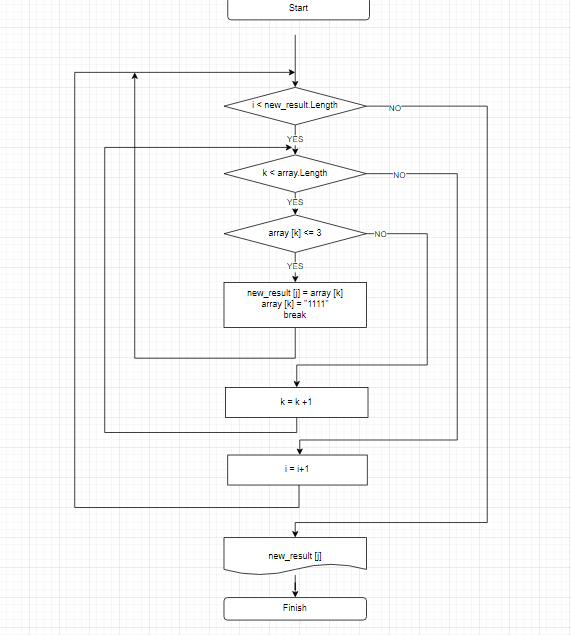

# Текстовое описание решения

## Задаем массив

Предлагаем пользователю задать массив из строковых элементов.
Для этого пользователь определяем кол-во элементов массива, после чего последовательно вводит каждый элемент, являющийся строкой, состоящей из символов.
Далее с помощью метода выводим массив на экран.

## Определяем длину нового масства
С помощью цикла определяем кол-во элементов в массиве, длина которых меньше либо равна 3. Это кол-во будет равняться кол-ву элементов нового массива, в который будем записывать элементы с длиной менее либо равно 3 символа.

## Записываем элементы в новый массив
С помощью метода, чтобы не менять исходный массив, пробегаем по двум циклам. Первый для записи в новый массив - его длину мы определили ранее - определяли кол-во элементов c длиной <=3. Во вложенном цикле вновь находим элементы с нужной длиной (используем условный оператор) и присваиваем последовательно в новый массив. После этого присваиваем им значение более 3 символов (1111) и принудительно выходим из вложенного цикла, чтобы при новом проходе они не искались. Повторяем поиск для следующего элемента нового массива.

## С помощью метода выводим новый массив.

*Блок-схема алгоритма - только основная содержательная часть*